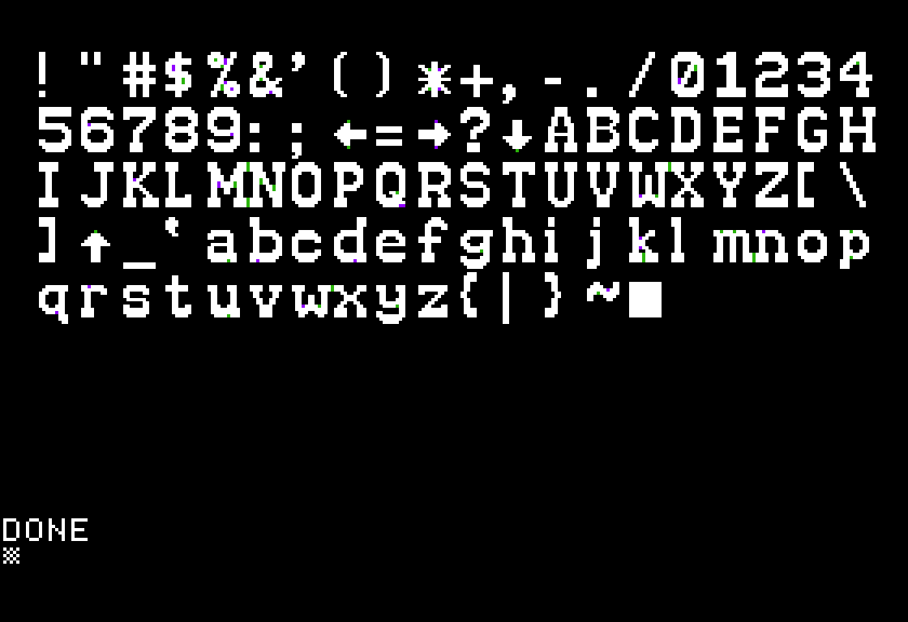

# Overview

`st` is a command-line tool to investigate and (ultimately) author shape tables for inclusion in Applesoft programs.

Samples are extracted from the [original Mouse Maze](https://github.com/a2geek/mouse-maze-2001/tree/master/doc/original), written in 1983.

# Usage

```shell
$ st --help
Usage: st [-hV] [--debug] [COMMAND]

Shape Tools utility

Options:
      --debug     Dump full stack traces if an error occurs
  -h, --help      Show this help message and exit.
  -V, --version   Print version information and exit.

Commands:
  extract   Extract shapes from shape table
  generate  Generate a shape table from source code
  help      Displays help information about the specified command
```

## Sub-command extract

```shell
$ st extract --help
Usage: st extract [-hO] [--skip-empty] [--stdin] [--stdout]
                  [--border=<borderStyle>] [--coding=<codeStyle>]
                  [--format=<outputFormat>] [-o=<outputFile>] [-w=<width>]
                  [--shapes=<shapeNums>]... [<inputFile>]

Extract shapes from shape table

Parameters:
      [<inputFile>]          File to process

Options:
      --border=<borderStyle> Set border style (none, simple, box)
                               Default: simple
      --coding=<codeStyle>   Select source style (bitmap, long, short)
                               Default: long
      --format=<outputFormat>
                             Select output format (text, source, png, gif, jpeg,
                               bmp, wbmp)
                               Default: text
      --shapes=<shapeNums>   Extract specific shape(s); formats are '1' or '1-4' and
                               can be combined with a comma
      --skip-empty           Skip empty shapes
      --stdin                Read from stdin
      --stdout               Write to stdout
  -h, --help                 Show help for subcommand
  -o, --output=<outputFile>  Write output to file
  -O, --optimize             Optimize vector shapes (source only)
  -w, --width=<width>        Set width (defaults: text=80, image=1024)
```

## Sub-command generate

```shell
$ st generate --help
Usage: st generate [-h] [--demo-code] [--single] [--stdin] [--stdout]
                   [--address=<address>] [--name=<realName>] [-o=<outputFile>]
                   [<inputFile>]

Generate a shape table from source code

Parameters:
      [<inputFile>]         File to process

Options:
      --address=<address>   Address for AppleSingle file
                              Default: 24576
      --demo-code           Generate a ProDOS .po image with Applesoft BASIC code
                              demoing the shape table
      --name=<realName>     Filename assign in AppleSingle file
                              Default: SHAPES.BIN
      --single              Write to AppleSingle file (requires address, defaults to
                              0x6000)
      --stdin               Read from stdin
      --stdout              Write to stdout
  -h, --help                Show help for subcommand
  -o, --output=<outputFile> Write output to file
```

# Features

## Text extract

```shell
$ st --debug extract --stdout --border=box --skip-empty --format=text --width=132 ~/Downloads/shapes/NEW\ MOUSE
┌─────────────────┬─────────────────┬─────────────────┬─────────────────┬─────────────────┬─────────────────┬─────────────────┐
│XXXXXXXXXXXXXXXX*│...........*X..  │......XXXXX...+  │XXXXXXXXXXXXXXX* │XXXXXXXXXXXXXXX* │.X.X.X.X.X.X.X.* │.X.X.X.X.X.X.X.* │
│X...............X│.....XXXX.XX...  │..XXXXX...XX...  │XXXXXXXXXXXXXXXX │XXXXXXXXXXXXXXXX │.X.X.X.X.X.X.X.X │.X.X.X.X.X.X.X.X │
│X...............X│....XXXXXXXX...  │......XXXXX....  │XXXXXXXXXXXXXXXX │XXXXXXXXXXXXXXXX │.X.X.XXXXXXX.X.X │.X.X.X.....X.X.X │
│X...............X│..XXXXXXXXXXX..  │...............  │XXXXXXXXXXXXXXXX │XXXXXXXXXXXXXXXX │.X..XX.....XX..X │.X.X.X.XXX.X.X.X │
│X...............X│.XX.XXXXXXX.XX.  │....XX..XXX....  │XXXXXXXXXXXXXXXX │XXXXXXXXXXXXXXXX │.X..X.XX.XX.X..X │.X.X..XX.XX..X.X │
│X...............X│.X...XXXXXXXXXX  │.....XX.XXX....  │XXXXXXXXXXXXXXXX │XXXXXXXXXXXXXXXX │.X..XX.....XX..X │.X.X.XX.XX.X.X.X │
│X...............X│.XX............  │.....XX.XXXX...  │XXXXXXXXXXXXXXXX │XXXXXX....XXXXXX │.X.X.XX.X.XX.X.X │.X.X.XXXX..X.X.X │
│X...............X│..XXX.XX.......  │....XX.XXXXX...  │XXXXXXXXXXXXXXXX │XXXXX......XXXXX │.X.X..XX.XX..X.X │.X..XX.X..XX.X.X │
│X...............X│....XXX........  │......XXXXXX...  │XXXXXXXXXXXXXXXX │XXXX........XXXX │.X..XX.XXX.XX..X │.X.XX..XX.XX.X.X │
│X...............X│...............  │...XXXXXXXXXXX.  │XXXXXXXXXXXXXXXX │XXXX........XXXX │.X.XXX..X..XXX.X │.X....XXXXXX.X.X │
│X...............X│...............  │..XX.........XX  │XXXXXXXXXXXXXXXX │XXX..........XXX │.X.X.XXX.XXX.X.X │.X.XXXXXXXXXXX.X │
│X...............X│                 │..XX.........XX  │XXXXXXXXXXXXXXXX │XXX..........XXX │.X.X...XXX...X.X │..XX.........XX. │
│X...............X│                 │...XXXXXXXXXXX.  │XXXXXXXXXXXXXXXX │XXX..........XXX │.X.X.XXX.XXX.X.X │..XX.........XX. │
│X...............X│                 │...............  │XXXXXXXXXXXXXXXX │XXX..........XXX │.X.XXX.X.X.XXX.X │.X.XXXXXXXXXXX.X │
│X...............X│                 │                 │XXXXXXXXXXXXXXXX │XXXXXXXXXXXXXXXX │.X..XX.X.X.XX..X │.X.X.X.X.X.X.X.X │
│X...............X│                 │                 │                 │                 │                 │                 │
│XXXXXXXXXXXXXXXXX│                 │                 │                 │                 │                 │                 │
├─────────────────┼─────────────────┼─────────────────┼─────────────────┼─────────────────┼─────────────────┼─────────────────┤
│.......XX.....+  │..X.X.X.X.X.X.X  │.X.X.X.X.X.X.X.* │.....XX*XXXX...  │                 │                 │                 │
│.....XX..X.....  │..X.X.X.X.X.X.X  │.X.X.X.X.X.X.X.X │.......XXX.....  │                 │                 │                 │
│...XX...XX.....  │..X.X.X.X.X.X.X  │.X.X.X.X.X.X.X.X │...XXXXXXXXXXX.  │                 │                 │                 │
│.......XXXX....  │..X.X.X.X.X.X.X  │.X.X.X.X.X.X.X.X │..XXXXXXXXXXXXX  │                 │                 │                 │
│.....XXXXXXXX..  │..X.X.X.X.X.X.X  │.X.X.X.X.X.X.X.X │..XXXXXXXXXXXXX  │                 │                 │                 │
│....XXX...XXXX.  │..X.X.X.X.X.X.X  │.X.X.X.X.X.X.X.X │..XXXXXXXXXXXXX  │                 │                 │                 │
│...XXXX.XX.XXXX  │..X.X.X.X.X.X.X  │.X.X.X.X.X.X.X.X │...............  │                 │                 │                 │
│...XXXX.XX.XXXX  │..X.X.X.X.X.X.X  │.X.X.X.X.X.X.X.X │                 │                 │                 │                 │
│...XXXX.XX.XXXX  │..X.X.X.X.X.X.X  │.X.X.X.X.X.X.X.X │                 │                 │                 │                 │
│...XXXX.XX.XXXX  │..X.X.X.X.X.X.X  │.X.X.X.X.X.X.X.X │                 │                 │                 │                 │
│....XXX...XXXX.  │..X.X.X.X.X.X.X  │.X.X.X.X.X.X.X.X │                 │                 │                 │                 │
│.....XXXXXXXX..  │..X.X.X.X.X.X.X  │.X.X.X.X.X.X.X.X │                 │                 │                 │                 │
│.......XXXX....  │..X.X.X.X.X.X.X  │.X.X.X.X.X.X.X.X │                 │                 │                 │                 │
│...............  │..X.X.X.X.X.X.X  │.X.X.X.X.X.X.X.X │                 │                 │                 │                 │
│                 │..X.X.X.X.X.X.X  │.X.X.X.X.X.X.X.X │                 │                 │                 │                 │
│                 │                 │                 │                 │                 │                 │                 │
│                 │                 │                 │                 │                 │                 │                 │
└─────────────────┴─────────────────┴─────────────────┴─────────────────┴─────────────────┴─────────────────┴─────────────────┘
```

## Graphics extract

```shell
$ st --debug extract --shape 3 --output robot.png --format png --border box ~/Downloads/shapes/NEW\ MOUSE
```

 

```shell
$ st --debug extract --output=new-mouse-shapes.png --border=box --skip-empty --format=png ~/Downloads/shapes/NEW\ MOUSE
```
 

## Shape generation

These samples show a variety of input methods and pipes the resulting (binary) shape table back to `st` to display the results. (Otherwise it's a bit hard to demonstrate!)

### Apple 'box'

```shell
$ cat api/src/test/resources/box-longform.st
; A vector box as given by Applesoft BASIC Programmer's Reference Manual

; Notes:
;   move[up|down|left|right] = move vector
;   plot[up|down|left|right] = plot vector
;   whitespace is ignored
;   case insensitive

.long label-long
    movedown 2
    plotleft 2
    moveup
    plotup 3
    moveright
    plotright 3
    movedown
    plotdown 3
    moveleft
    plotleft

$ st generate --stdout api/src/test/resources/box-longform.st | st extract --stdin --stdout
+-----+
|.XXX.|
|X...X|
|X.+.X|
|X...X|
|.XXX.|
+-----+
```

### The Mouse Maze mouse

```shell
$ cat mouse.st
; extracted from NEW MOUSE

.bitmap
    ..........*X..  
    ....XXXX.XX...  
    ...XXXXXXXX...  
    .XXXXXXXXXXX..  
    XX.XXXXXXX.XX.  
    X...XXXXXXXXXX  
    XX............  
    .XXX.XX.......  
    ...XXX........  

$ st generate --stdout mouse.st | st extract --format=source --coding=short --stdin --stdout
.short
  DDDRDDRRUlLdlLLLLLLURRRRRULLLLLLDUlLDLDDRDRRDRRURUuluuruRRRULlLLDLLUrRrrrurrrU

```

## Generate to AppleSingle

```shell
$ cat api/src/test/resources/box-longform.st | st generate --stdin --stdout --single | asu info --stdin
Real Name: SHAPES.BIN
ProDOS info:
  Access: 0xC3
  File Type: 0x06
  Auxtype: 0x6000
File dates info:
  Creation: 2018-06-20T01:36:59Z
  Modification: 2018-06-20T01:36:59Z
  Access: 2018-06-20T01:36:59Z
  Backup: 2018-06-20T01:36:59Z
Data Fork: Present, 14 bytes
Resource Fork: Not present
```

## Generate demo disk

Demonstration of a Beagle Bros font:

```shell
st --debug extract --format=source --coding=short ~/Downloads/shapes/\]WESTERN.dump --stdout --skip-empty --optimize |
    st generate --demo-code -o western.po --stdin
```


